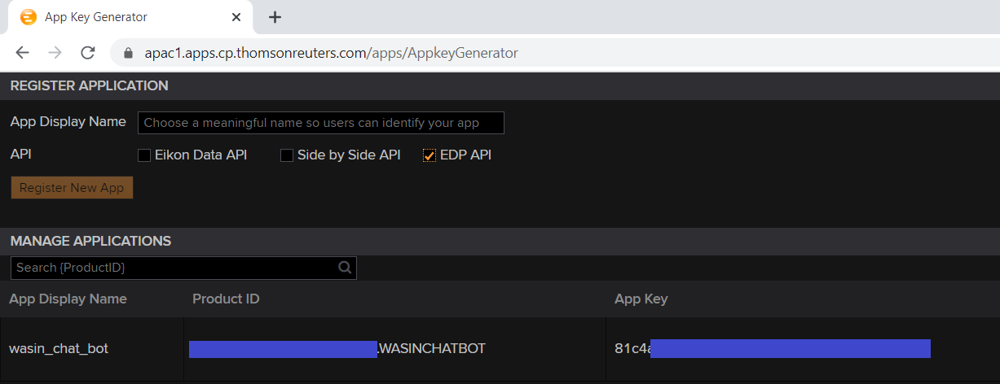
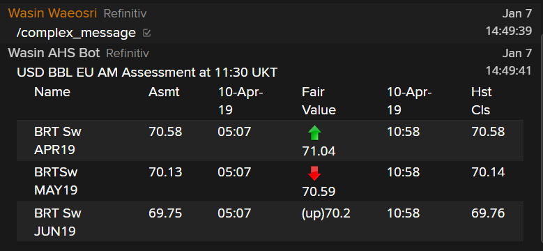

# Messenger Bot API Tutorial
- Last update: September 2021
- Environment: Windows
- Compiler: Node.js
- Prerequisite: [Access to Messenger application](#prerequisite)

## Introduction


Refinitiv's [Messenger application](https://www.refinitiv.com/en/products/refinitiv-messenger/) is a free to use, compliant and secure messaging platform.  It is a powerful communication tool that provides desktop, mobile, and web access, and allows sharing messages, data, files, screenshots, and emoticons with your contacts.

The [Messenger Bot API](https://developers.refinitiv.com/en/api-catalog/messenger-api/messenger-bot-api) provides a set of available API calls to build automated workflows or bots for the Messenger application. The Bot API allows your applications to connect with and pass information into Eikon’s Messenger service programmatically or interact with a bot via a WebSocket connection.

## Table of contents
* [Overview](#overview)
* [Prerequisite](#prerequisite)
* [Getting the AppKey value](#appkey)
* [Setting the Messenger application](#setting)
* [Setting the environment for Demo application](#setting-env)
* [Running the Quick Start Demo](#running-quickstart)
* [Running the REST Demo](#running-rest)
* [Running the WebSocket Demo](#running-ws)
* [Running demo applications with debug log](#running-debug)
* [Authors](#author)
* [References](#references)

## <a id="overview"></a>Messenger Bot API Demo overview

This demo project shows how to implement the Messenger BOT API console applications with the REST and WebSocket APIs in JavaScript programming language and [Node.js](https://nodejs.org/en/) runtime environment. The applications makes an authentication with [Refinitiv Data Platform (RDP)](https://developers.refinitiv.com/en/api-catalog/refinitiv-data-platform/refinitiv-data-platform-apis) Authentication service, then lets developers interact with Messeger Application/Chatroom on behalf of the Bot via the REST and WebSocket APIs. 

This project contains the following example applications:
- *chatbot_quickstart.js*: A REST API Quick Start example that sends chat message to recipient Email. 
- *chatbot_demo_rest.js*: A REST API example that sends chat message to individual and a Chatroom. 
- *chatbot_demo_ws.js*: A REST and WebSocket APIs example that sends and receives chat message with a Chatroom. 

Note: Please note that the main concept for using Messager Bot REST and WebSocket APIs are the same for all technologies (see [Python example](https://github.com/Refinitiv-API-Samples/Example.MessengerChatBot.Python)). 

## <a id="prerequisite"></a>Prerequisite 
This tutorial source code requires the following dependencies.
1. Refinitiv [Eikon Messenger](https://www.refinitiv.com/en/products/eikon-trading-software/eikon-messenger-securemessaging) or Refinitiv Workspace application with access to Messenger Bot API access.
2. [Node.js](https://nodejs.org/en/) runtime.
3. [npm](https://www.npmjs.com/) package manager (included in Node.js).

Please contact your Refinitiv's representative and Dino Diviacchi (dino.diviacchi@refinitiv.com) to help you to access Eikon Message and Bot API. The Refinitiv team will then provision and set up the bot. Once this is done the email user you provided will receive an automated email with how to set up a password for the bot.

## <a id="appkey"></a>Getting the AppKey value

Once you have setup your Eikon Messenger user, please access the AppKey Generator Tool via Eikon Desktop/Refinitiv Workspace application (go to the Search Bar and type ```APP KEY```, then select the AppKey Generator). Please access with your Eikon account, *not your bot account*.

You can generate your AppKey via the following steps:
1. Enter an App Display Name
2. Select the tick box next to EDP API as the API Type
3. Click ‘Register’ New App button

You will then see a row for your new application with an App Key column, which is your client_id (or AppKey) for the Refinitiv Data Platform (RDP) Authentication.

 

## <a id="setting"></a>Setting the Messenger application

Once you have setup your Eikon Messenger user and Bot user, you can add the Bot and create a Chatroom for you and your Bot via the following steps

1. Login to your personal Eikon Messenger to add the bot to your contacts, using “Add a New Contact” from the menu in the lower left corner.

     

2. Add bot name **bot_agent.mybot@refinitiv.com**.

     

3. Once you have add the bot it will show up under your contacts (on the left side).

     

4. Create a chatroom using "Create a Bilateral chatroom" button from the menu in the lower left corner.

     

5. Add your Bot to a chatroom by dragging it into your newly created chatroom. 

     

## <a id="setting-env"></a>Setting the environment for Demo application
1. Unzip or download the tutorial project folder into a directory of your choice 
2. Run ```$>npm install``` command in the command prompt to install all the dependencies required to run the sample in a subdirectory called *node_modules/*.
3. If the machine is behind a proxy server, you need to configure Node.js uses proxy instead of a direct HTTP connection via the following command in command prompt: 
    ```
    set https_proxy=http://<proxy.server>:<port>
    ```

## <a id="running-quickstart"></a>Running the Quick Start Demo
1. Open the *chatbot_quickstart.js* demo application source code with your editor and input the following parameters
    - ```APPKey```: Your AppKey
    - ```bot_username```: Your Bot username
    - ```bot_password```: Your Bot password
    - ```recipient_email``` : Your assoicate Eikon messenger email address 
2. Open a command prompt and folder *src* and run the tutorial application with the following command.
    ```
    $>node chatbot_quickstart.js
    ```

## <a id="running-rest"></a>Running the REST Demo
1. Open the *chatbot_demo_rest.js* demo application source code with your editor and input the following parameters
    - ```APPKey```: Your AppKey
    - ```bot_username```: Your Bot username
    - ```bot_password```: Your Bot password
    - ```recipient_email``` : Your assoicate Eikon messenger email address 
2. Open a command prompt in folder *src* and run the tutorial application with the following command.
    ```
    $>node chatbot_demo_rest.js
    ```
3. The application then authenticates with [RDP](https://developers.refinitiv.com/refinitiv-data-platform) Authentication service and sends a 1-1 message to your assoicate Eikon message email address. 
    ```
    Getting RDP Authentication Token
    Successfully Authenticated
    Send 1 to 1 message to <email>
    Messenger BOT API: post a 1 to 1 message to <email> success
    ```
4. Then the application gets an associate Chatroom and joining to that Chatroom. 
    ```
    Get Rooms
    { chatrooms:
        [ { chatroomId: 'groupchat-dXXXXXXX',
            name: 'CHATROOM_NAME',
            createdTime: '2019-11-21T07:11:24Z' } ] }
    Join Rooms
    ```
5. Once the demo application shows ```Join Rooms``` event, demo application will send a default ```Hello from JavaScript/Node.js``` message to a Chatroom on behalf of the Bot API before leaving a Chatroom.
    ```
    Join Rooms
    sending message to groupchat-dXXXXXXX Rooms
    Post message to Chatroom success
    Leave Rooms
    ```

## <a id="running-ws"></a>Running the WebSocket Demo
1. Open the *chatbot_demo_ws.js* demo application source code with your editor and input the following parameters
    - ```APPKey```: Your AppKey
    - ```bot_username```: Your Bot username
    - ```bot_password```: Your Bot password
    - ```recipient_email``` : Your assoicate Eikon messenger email address 
2. Open a command prompt in folder *src* and run the tutorial application with the following command.
    ```
    $>node chatbot_demo_ws.js
    ```
3. The application then authenticates with [RDP](https://developers.refinitiv.com/refinitiv-data-platform) Authentication service and sends a 1-1 message to your assoicate Eikon message email address. 
    ```
    Getting RDP Authentication Token
    Successfully Authenticated
    Send 1 to 1 message to <email>
    Messenger BOT API: post a 1 to 1 message to <email> success
    ```
4. Then the application gets an associate Chatroom and joining to that Chatroom. Once the tutorial shows WebSocket ```connected``` event, you can start interact with your bot via a chatroom.
    ```
    Get Rooms
    { chatrooms:
        [ { chatroomId: 'groupchat-dXXXXXXX',
            name: 'CHATROOM_NAME',
            createdTime: '2019-11-21T07:11:24Z' } ] }
    Join Rooms
    WebSocket Client Connected
    Received: {"reqId":"327344.6792","event":"connected"}
    ```
5. Now we should be able to receive a response from our chatbot. You can test by sending ```/help``` message in to a Chatroom to see an example.
6. Eikon Messenger supports tabular data, hyperlinks and a full set of emoji in the message. You can type ```/complex_message``` into a Chatroom to see an example.
    


## <a id="running-debug"></a>Running demo applications with debug log
You can enable the REST and WebSocket demo applications debug log level via ```logger.level = 'info';``` application source code statement.The supported values are *info* and *debug* levels.

The *debug* level shows incoming and outgoing messages between the demo applications and Messenger BOT API REST and WebSocket servers.

## <a id="author"></a>Authors
- Wasin Waeosri (wasin.waeosri@refinitiv.com)
- Dino Diviacchi (dino.diviacchi@refinitiv.com)

## <a id="references"></a>References
For further details, please check out the following resources:
* [Refinitiv Messenger Bot API page](https://developers.refinitiv.com/en/api-catalog/messenger-api/messenger-bot-api) on the [Refinitiv Developer Community](https://developers.refinitiv.com/) web site.
* [Refinitiv Messenger Bot API: Quick Start](https://developers.refinitiv.com/en/api-catalog/messenger-api/messenger-bot-api). 
* [Refinitiv Messenger Bot API: Documentation page](https://developers.refinitiv.com/en/api-catalog/messenger-api/messenger-bot-api/documentation).
* [Node.js Documentation page](https://nodejs.org/dist/latest-v12.x/docs/api/).

For any question related to the Messenger Bot API, please use the Developer Community [Q&A Forum](https://community.developers.refinitiv.com/spaces/303/index.html).