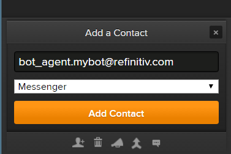
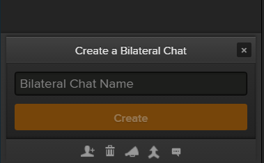

# Messenger Bot API Tutorial
- Last update: November 2019
- Environment: Windows
- Compiler: Node.js
- Author: Dino Diviacchi (dino.diviacchi@refinitiv.com)
- Prerequisite: [Access to Eikon Messenger](#prerequisite)

## Introduction

[Eikon Messenger](https://www.refinitiv.com/en/products/eikon-trading-software/eikon-messenger-securemessaging) is a free to use, compliant and secure messaging platform.  It is a powerful communication tool that provides desktop, mobile, and web access, and allows sharing messages, data, files, screenshots, and emoticons with your contacts.

The [Messenger Bot API](https://developers.refinitiv.com/messenger-api) provides a set of available API calls to build automated workflows or bots for Eikon Messenger. The Bot API allows your applications to connect with and pass information into Eikon’s Messenger service programmatically or interact with a bot via a WebSocket connection.

## Table of contents
* [Prerequisite](#prerequisite)
* [Getting the AppKey value](#appkey)
* [Running the Tutorial](#running)
* [Authors](#author)
* [References](#references)

## <a id="prerequisite"></a>Prerequisite 
This tutorial source code requires the following dependencies.
1. [Eikon Messenger](https://www.refinitiv.com/en/products/eikon-trading-software/eikon-messenger-securemessaging).
2. [Node.js](https://nodejs.org/en/) runtime.
3. [npm](https://www.npmjs.com/) package manager (included in Node.js).
4. Eikon Messenger Bot API access and license.

Please contact your Refinitiv's representative and Dino Diviacchi (dino.diviacchi@refinitiv.com) to help you to access Eikon Message and Bot API. The Refinitiv team will then provision and set up the bot. Once this is done the email user you provided will receive an automated email with how to set up a password for the bot.

## <a id="appkey"></a>Getting the AppKey value

Once you have setup your Eikon Messenger user, please access the AppKey Generator Tool via Eikon Desktop/Refinitiv Workspace application (go to the Search Bar and type ```APP KEY```, then select the AppKey Generator) or via a <a href="https://amers1.apps.cp.thomsonreuters.com/apps/AppkeyGenerator">web site</a> (Please access with your Eikon account, *not your bot account*). 

 

You can generate your AppKey via the following steps:
1. Enter an App Display Name
2. Select the tick box next to EDP API as the API Type
3. Click ‘Register’ New App button

You will then see a row for your new app with an AppKey item, which is your client_id for the Refinitiv Data Platform (RDP) Authentication. 

## <a id="running"></a>Running the Tutorial
1. Unzip or download the tutorial project folder into a directory of your choice 
2. Run ```$> npm install``` command in the command prompt to install all the dependencies required to run the sample in a subdirectory called *node_modules/*.
3. If the machine is behind a proxy server, you need to configure Node.js uses proxy instead of a direct HTTP connection via the following command in command prompt: 
    ```
    set https_proxy=http://<proxy.server>:<port>
    ```
4. Login to your personal Eikon Messenger to add the bot to your contacts, using “Add a New Contact” from the menu in the lower left corner.

     

5. Add bot name **bot_agent.mybot@refinitiv.com**.

     

6. Once you have add the bot it will show up under your contacts (on the left side).

     

7. Create a chatroom using "Create a Bilateral chatroom" button from the menu in the lower left corner.

     

8. Add your Bot to a chatroom by dragging it into your newly created chatroom. 

     

9. You will then be able to send messages to chatrooms using the API calls
10. Open tutorial application source code with your editor and input the following parameters
    - ```APPKey```: Your AppKey
    - ```bot_username```: Your Bot username
    - ```bot_password```: Your Bot password
11. Open a command prompt and folder *src* and run the tutorial application with the following command.
    ```
    $>node tutorial_chatbot.js
    ```
12. Once the tutorial shows WebSocket ```connected``` event, you can start interact with your bot via a chatroom.
    ```
    $>node tutorial_chatbot.js
    Get Token
    Get Rooms
    { chatrooms:
        [ { chatroomId: 'groupchat-dXXXXXXX',
            name: 'CHATROOM_NAME',
            createdTime: '2019-11-21T07:11:24Z' } ] }
    Join Rooms
    WebSocket Client Connected
    Received: {"reqId":"327344.6792","event":"connected"}
    ```

## <a id="author"></a>Authors
- Dino Diviacchi (dino.diviacchi@refinitiv.com)

## <a id="references"></a>References
For further details, please check out the following resources:
* [Refinitiv Messenger Bot API page](https://developers.refinitiv.com/messenger-api) on the [Refinitiv Developer Community](https://developers.refinitiv.com/) web site.
* [Refinitiv Messenger Bot API: Quick Start](https://developers.refinitiv.com/messenger-api/messenger-bot-api/quick-start). 
* [Refinitiv Messenger Bot API: Documentation page](https://developers.refinitiv.com/messenger-api/messenger-bot-api/docs).
* [Node.js Documentation page](https://nodejs.org/dist/latest-v12.x/docs/api/).